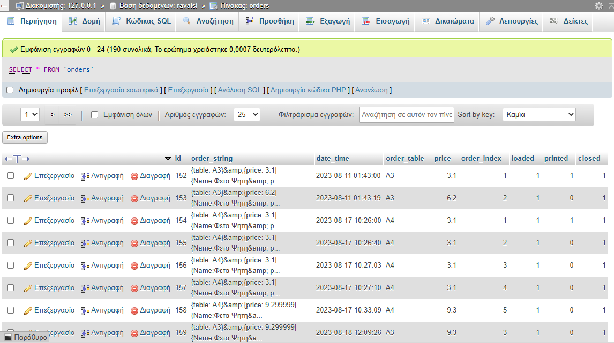

# RavaisiPDA Backend

## Description

The RavaisiPDA Backend is built using PHP and serves as the interface between the Android application and the MySQL database. It allows the Android application to send and delete products and categories, as well as send orders to the database.

## Features

* **Product Management**: 
  * Add, update, and delete products from the database.
  
* **Category Management**: 
  * Add and delete categories as necessary.
  
* **Order Handling**: 
  * Receive and store orders sent from the Android application to the database.

* **CSV Database Import**: 
  * The repository includes a CSV file containing the database structure, allowing users to import it during setup.

## Setup Instructions

1. **XAMPP Installation**: 
   * Make sure you have XAMPP installed and running with MySQL.

2. **Place PHP Files**: 
   * Copy the PHP files into the `htdocs` folder of your XAMPP installation.

3. **Database Setup**: 
   * Import the provided CSV file into your MySQL database to set up the initial structure.

4. **Configure Database Connection**: 
   * Ensure that the database credentials in your PHP files match those of your MySQL database.
## Basic Functionality

### Send Order Function

The `sendOrder` function handles the process of sending an order to the MySQL database. It prepares the order details and executes the appropriate SQL commands to store the order.

```php

function sendOrder($table, $order_string, $order_table, $price)
{
    $table = $this->prepare_string($table);
    $order_string = $this->prepare_string($order_string);
    $order_table =  $this->prepare_string($order_table);
    $price = $this->prepare_string($price);
    $date_time = date("Y-m-d h:i:sa");
    $this->sql = "SELECT order_index FROM ".$table. " WHERE order_table = "."'".$order_table."' AND closed=0 ORDER BY order_index DESC LIMIT 1";
    $result = mysqli_query($this->db_connect(), $this->sql);
    $res = "";
    $order_index = "";
    if ($result == "")
    {
        $this->sql = "INSERT INTO ".$table." (order_string, date_time, order_table, price ) VALUES ('".$order_string."','".$date_time."','".$order_table."','".$price."')";
        if (mysqli_query($this->db_connect(), $this->sql))
        {
            return true;
        }
        else
        {
            return false;
        }
    }   
    else
    {
        $row = mysqli_fetch_assoc($result);
        $res = intval($row["order_index"]);
        $res = $res + 1;
        $order_index = $this->prepare_string($res);
        $this->sql = "INSERT INTO ".$table." (order_string, date_time, order_table, price, order_index ) VALUES ('".$order_string."','".$date_time."','".$order_table."','".$price."','".$order_index."')";
        if (mysqli_query($this->db_connect(), $this->sql))
        {
            return true;
        }
        else
        {
            return false;
        }
    }
}
```
**Explanation**
* **Functionality:**
  * This function takes parameters for the table name, order string, order table, and price, and inserts the order into the specified MySQL table.
* **String Preparation:**
  * It uses a method (prepare_string) to sanitize input data to prevent SQL injection.
* **Order Index Handling:**
  * It checks for existing orders in the table. If none exist, it inserts the new order.
   If there are existing orders, it retrieves the last order index to increment it for the new order.
* **Database Interaction:**
  * The function executes SQL queries to insert the order and returns true or false based on the success of the operation.
## Database Structure

The RavaisiPDA application utilizes a MySQL database consisting of four main tables: **Orders**, **Products**, **Categories**, and **Toppings**.
### Orders



*Orders Table: Displays all incoming orders, including details such as order ID, serialized order string, date and time of submission, total price, order index, and status indicators for loaded, printed, and closed orders.*

### 1. Orders Table
* **id**: Unique identifier for each order.
* **order_string**: Contains the serialized representation of the order.
* **date_time**: Records the date and time the order was sent.
* **price**: The total price of the order.
* **order_index**: An index that tracks the order's position, starting from the first order made by a specific table until the customers leave.
* **loaded**: Boolean indicating whether the order has been opened by the user of the desktop application.
* **printed**: Boolean indicating whether the order has been printed.
* **closed**: Boolean indicating if the order is still open or if it has been closed.

### 2. Products Table
* **id**: Unique identifier for each product.
* **name**: The name of the product.
* **price**: The price of the product.
* **category_id**: Foreign key referencing the category the product belongs to.
* **toppings**: Optional toppings that can be associated with the product.

### 3. Categories Table
* **id**: Unique identifier for each category.
* **name**: The name of the category.

### 4. Toppings Table
* **id**: Unique identifier for each topping.
* **name**: The name of the topping.
* **extra_charge**: Additional cost associated with the topping.
## Usage

* The Android application will make API calls to the PHP scripts to manage products, categories, and orders.
* Users can upload the CSV file to create the necessary database structure during initial setup.

## Contributing

Contributions are welcome! Here’s how you can help improve the project:

1. **Fork the repository**: Create your own copy of the project on your GitHub account.
2. **Make Changes**: Implement improvements or fixes in a new branch.
3. **Test Your Changes**: Ensure that everything works as expected.
4. **Submit a Pull Request**: Submit changes back to the main repository with a description of the changes made.

### Guidelines

* Follow the project’s coding style.
* Write clear and descriptive commit messages.

## Contact

If you have any questions or need assistance, please reach out to [your contact information].
